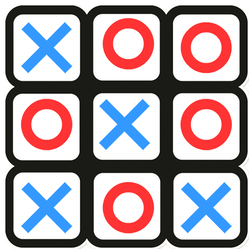
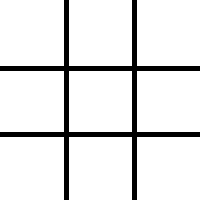

# Tic Tac Toe The Game

> The purpose of this project is to setup the Tic Tac Toe game, for two players, using Ruby.

 TIC TAC TOE is game for two players represented by a X for one player and a O for the other one. Each player take turns marking the spaces in a 3×3 grid. The main goal is to place three of their marks in a horizontal, vertical, or diagonal row, the one to do this first is the winner. For additional information go to [TicTacToeWiki](https://en.wikipedia.org/wiki/Tic-tac-toe)

## Rules for the Tic Tac Toe Game

- The game is played on a grid that's 3 squares by 3 squares.

- You are X, your friend (or the computer in this case) is O. Players take turns putting their marks in empty squares.

- The first player to get 3 of her marks in a row (up, down, across, or diagonally) is the winner.

- When all 9 squares are full, the game is over. If no player has 3 marks in a row, the game ends in a tie.

