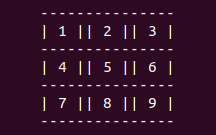

# Tic Tac Toe The Game

> The purpose of this project is to setup the Tic Tac Toe game, for two players, using Ruby.

 TIC TAC TOE is game for two players represented by a X for one player and a O for the other one. Each player take turns marking the spaces in a 3×3 grid. The main goal is to place three of their marks in a horizontal, vertical, or diagonal row, the one to do this first is the winner. For additional information go to [TicTacToeWiki](https://en.wikipedia.org/wiki/Tic-tac-toe)

## Rules for the Tic Tac Toe Game

- The game is played on a grid that's 3 squares by 3 squares.

- You are X, your friend (or the computer in this case) is O. Players take turns putting their marks in empty squares.

- The first player to get 3 of her marks in a row (up, down, across, or diagonally) is the winner.

- When all 9 squares are full, the game is over. If no player has 3 marks in a row, the game ends in a tie.

## Built With

- Ruby,

## Getting Started

To get a local copy up and running follow these simple example steps.

### Prerequisites
You need to have Ruby installed in your machine

### Setup
You can make the main file executable in linux by changing the permissions with the following command:

- chmod 755 main.rb

After doing this you can run it by simply typing in the console ./main.rb

### Install
In order to run, you need to install RUBY in your computer. For windows you can go to [Ruby installer](https://rubyinstaller.org/) and for MAC and LINUX you can go to [Ruby official site](https://www.ruby-lang.org/en/downloads/) for intructions on how to intall it.

### Usage
The first thing you are asked for is the player names, when the prompt shows you can enter your name. 

The board has numbers inside indicating the positions you can take.

After the board is displayed the first player has to choose a position

Then the second player is asked for his position

And it goes back and forth until the game ends. 

If the player has the chance to win then the game will tell before you place your move

After you win  the game will congratulate you and ask you if you want to start a new game

If nobody wins the game will let you know and ask you if you want to play again

## Authors

👤 **Mateo Mojica**

- Github: [@mateomh](https://github.com/mateomh)
- Twitter: [@mateo_m_h](https://twitter.com/mateo_m_h)
- Linkedin: [Mateo Mojica](https://linkedin.com/mateo_mojica_hernandez)

👤 **Tadeu Sarro**

- Github: [@tadeuasarro](https://github.com/tadeuasarro)
- Twitter: [@tadeuasarro](https://twitter.com/tadeuasarro)
- Linkedin: [Tadeu Sarro](https://www.linkedin.com/in/tadeuasarro/)

## 🤝 Contributing

Contributions, issues and feature requests are welcome!

Feel free to check the [issues page](issues/).

## Show your support

Give a ⭐️ if you like this project!

## Acknowledgments

- Microverse
- Odin Project

## 📝 License

This project is [MIT](https://opensource.org/licenses/MIT) licensed.